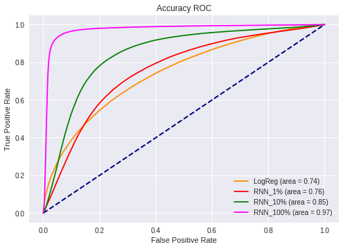

# Experiment 1 

## Goal 
For this pilot experiment we aimed to see which machine learning algorithm perfomed better in classifying what candidates are true candidates versus random co-occurence. 

## Methods
Thanks to [pubtator](https://github.com/greenelab/pubtator) we were able to convert NCBI's [PubTator](https://www.ncbi.nlm.nih.gov/CBBresearch/Lu/Demo/PubTator/) dataset into the correct format for snorkel to parse (xml). Starting from the first notebook, each abstract is parsed using snorkel's XMl reader and stanford's corenlp package. Using a seed of 100, we randomly separated each individual sentence into three categories: train, dev and test (70%, 20%, 10% of the dataset respectively). After the random assortment of sentences, the candidate extraction process beings. This process uses PubTator's tagging strategy to extract two co-occuring tagged entities from a given sentence (This co-occurence is considered a candidate). Based on the above split each candidate that was extracted belongs to that given category. Once the candidate extraction process is finished the next step is to label each candidate based on given label fucntions. Using the potential noisy labels we trained a generative model (Factor Graphs with Gibbs Sampling) to determine the mariginal probability that a given candidate is a true candidate (cutoff of >0.5 for pos label). Lastly, the last step is to pass the labels above into a discriminator model (SparseLogisticRegression, LSTM i.e.) to classify each candidate above. 

## Results

This Receiver Operating Charateristic (ROC) curve is a classic text book example where deep learning output performs regular learning. Within this graph as more data is added to the model the accuracy increases substantially. The marginals for each model are located in the disc_model.csv.

## Take Home Points
This result leads us to take the next step in our experiments and determine if the LSTM is actually learning what we want it to learn. (Experiment 2) Furthermore, snorkel is not that robust for the amount of data that this project is throwing at it. Most of my code is memory-efficient, which also leads me to have fingers crossed for more updates on this frame work. Since a 64 bit machine cannot run a LSTM had to resort to penn's high performance cluster. Make sure next time to run with a lot more threads than 4. 